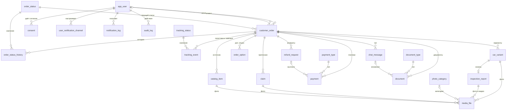

# Проект схемы данных «Car Import Tracker»

Документ описывает модель данных для PostgreSQL: таблицы, поля, связи и принятые решения. Модель выведена из [требований](../requirements.md); в разделе 8 каждая таблица связана с FR и NFR.

Соглашения: имена в `snake_case` на английском, таблицы в единственном числе (исключение — `customer_order`, так как `order` зарезервировано), первичные ключи `bigint` с автогенерацией, деньги в `numeric(12,2)` (рубли), время в `timestamptz`.

---

## 1. Ключевые решения

| Вопрос | Решение | Почему |
|---|---|---|
| Заказ и автомобиль | У заказа несколько вариантов (`car_variant`), принятым может быть только один | Процесс допускает возврат к подбору (FR-04, FR-07). Один принятый вариант на заказ обеспечивает частичный уникальный индекс |
| Параметры заявки | Хранятся в заказе (`req_*`), а предложенные автомобили — в вариантах | Это разные факты: что хотел клиент и что предложил агент (FR-02, FR-03) |
| Пользователи | Одна таблица `app_user` с ролью | Клиент, агент и администратор делят вход, e-mail и телефон (FR-01); специфичных полей у ролей нет |
| Паспорт клиента | Отдельных полей нет, только копия как документ | Системе не нужны номер и серия (минимизация данных по 152-ФЗ), нужна копия документа |
| Статусы заказа | Справочник `order_status` + неизменяемая таблица истории | История не должна меняться задним числом (FR-14) |
| Статусы логистики и таможни | Отдельные справочник и таблица событий | Это подстатусы внутри этапов 7–9 и 8, у них свой набор значений и обязательная причина (FR-11, FR-12) |
| Статусы платежей, претензий, решений | Ограничения `CHECK` в самой таблице | Значения фиксированы логикой процесса и не редактируются администратором |
| Справочники | `document_type`, `payment_type`, `photo_category` | FR-19: администратор управляет ими |
| Файлы | В БД только метаданные, сам файл в хранилище (`storage_key`) | Файлы большие; отдельное хранилище и нужное шифрование (NFR-02) |
| Фото и видео | Одна таблица `media_file`, у каждой записи ровно один владелец (вариант, отчёт, претензия или карточка каталога) | Единые правила проверки (раздел 4.1 требований) и единый механизм удаления |
| Документы | Отдельная таблица `document`, привязана к заказу, типу и этапу | FR-10: документы имеют тип и этап, а срок хранения у них 5 лет |
| Каталог | Самостоятельная сущность `catalog_item` со ссылкой на исходный заказ только для внутреннего учёта | В каталоге нет данных клиента (FR-17); карточку можно снять, не трогая заказ |
| Возвраты | `refund_request` отдельно от `payment` | У запроса свои статусы (FR-05), а выплата — платёж типа «возврат» |
| Срок хранения | Дата завершения заказа, дата решения по варианту и признак очистки `purged_at` | Из них считаются сроки таблицы 5.1 (раздел 5 этого документа) |
| Прикрепления чата | Вложение сообщения — запись в `document` со ссылкой на сообщение | Вложения проходят те же ограничения, что и документы (FR-18) |

---

## 2. Обзорная диаграмма

Диаграмма показывает только таблицы и связи, без полей. Подробные атрибуты — в разделе 4. GitHub отображает Mermaid автоматически.

---

## 3. Как разбить на диаграммы в draw.io

Как и с Use Case, одна схема на 23 таблицы будет перегружена. Рекомендуемая разбивка:

| Диаграмма | Таблицы |
|---|---|
| ER-00. Обзор | Только названия таблиц и связи (как Mermaid выше) |
| ER-01. Пользователи и заказ | `app_user`, `consent`, `user_notification_channel`, `customer_order`, `order_status`, `order_status_history`, `tracking_status`, `tracking_event` |
| ER-02. Подбор и осмотр | `customer_order` (ссылка), `car_variant`, `inspection_report`, `media_file`, `photo_category`, `order_option` |
| ER-03. Платежи, документы, претензии | `customer_order` (ссылка), `payment`, `payment_type`, `refund_request`, `document`, `document_type`, `claim` |
| ER-04. Каталог, чат и служебные | `catalog_item`, `chat_message`, `notification_log`, `audit_log`, `media_file` (ссылка) |

Для каждой диаграммы: нотация «вороньи лапки», отмечены PK и FK, справочники выделены цветом.

---

## 4. Таблицы

### 4.1 Пользователи и согласия

**app_user** — пользователь любой роли.

| Поле | Тип | Ограничения | Комментарий |
|---|---|---|---|
| user_id | bigint | PK | |
| role | text | NOT NULL, CHECK in (`client`, `agent`, `admin`) | |
| full_name | text | NOT NULL | |
| email | text | NOT NULL, UNIQUE | Канал уведомлений и логин |
| phone | text | UNIQUE | Нужен для SMS |
| password_hash | text | NOT NULL | Только необратимый хэш (NFR-02) |
| is_active | boolean | NOT NULL, по умолчанию true | Блокировка вместо удаления (FR-19) |
| created_at | timestamptz | NOT NULL | |
| anonymized_at | timestamptz | | Заполняется при обезличивании (NFR-06, NFR-08) |

**consent** — согласие на обработку персональных данных.

| Поле | Тип | Ограничения | Комментарий |
|---|---|---|---|
| consent_id | bigint | PK | |
| user_id | bigint | FK → app_user, NOT NULL | |
| doc_version | text | NOT NULL | Версия текста согласия |
| accepted_at | timestamptz | NOT NULL | |
| revoked_at | timestamptz | | Отзыв фиксируется, не удаляя запись |

**user_notification_channel** — настройки каналов клиента.

| Поле | Тип | Ограничения | Комментарий |
|---|---|---|---|
| user_id | bigint | PK (часть), FK → app_user | |
| channel | text | PK (часть), CHECK in (`email`, `sms`, `telegram`) | |
| is_enabled | boolean | NOT NULL | Должен остаться хотя бы один включённый канал (правило на уровне приложения) |
| telegram_chat_id | text | | Обязателен для включённого Telegram |

### 4.2 Заказ и статусы

**order_status** — справочник статусов заказа (13 значений из раздела 3 требований).

| Поле | Тип | Ограничения | Комментарий |
|---|---|---|---|
| status_id | bigint | PK | |
| code | text | NOT NULL, UNIQUE | Например `inspection`, `awaiting_payment` |
| name | text | NOT NULL | Название для интерфейса |
| sort_order | smallint | NOT NULL | Порядок этапов |
| is_final | boolean | NOT NULL | «Завершён» и «Отменён» |

**customer_order** — заказ клиента.

| Поле | Тип | Ограничения | Комментарий |
|---|---|---|---|
| order_id | bigint | PK | |
| client_id | bigint | FK → app_user, NOT NULL | Роль `client` проверяется в приложении или триггером |
| agent_id | bigint | FK → app_user | Назначается, когда агент берёт заказ |
| current_status_id | bigint | FK → order_status, NOT NULL | Текущее значение; полная история в `order_status_history` |
| req_brand | text | NOT NULL | Параметры заявки (FR-02) |
| req_model | text | NOT NULL | |
| req_budget_rub | numeric(12,2) | NOT NULL, CHECK > 0 | |
| req_year | smallint | | Необязательно |
| req_mileage_max_km | integer | | Необязательно |
| req_options | text | | Желаемые опции, свободный текст |
| created_at | timestamptz | NOT NULL | |
| booked_at | timestamptz | | Бронирование (FR-09) |
| purchased_at | timestamptz | | Выкуп (FR-09) |
| handed_over_at | timestamptz | | Передача клиенту; от этой даты считаются 14 дней (FR-13, FR-16) |
| act_signed_at | timestamptz | | |
| act_signed_auto | boolean | NOT NULL, по умолчанию false | Акт считается подписанным по истечении срока |
| completed_at | timestamptz | | Начало отсчёта сроков хранения |

**order_status_history** — неизменяемая история статусов (FR-14).

| Поле | Тип | Ограничения | Комментарий |
|---|---|---|---|
| history_id | bigint | PK | |
| order_id | bigint | FK → customer_order, NOT NULL | Индекс (order_id, changed_at) |
| status_id | bigint | FK → order_status, NOT NULL | |
| changed_by | bigint | FK → app_user | NULL, если изменила система |
| comment | text | | Например причина отклонения варианта |
| changed_at | timestamptz | NOT NULL, по умолчанию now() | |

Запрет на изменение и удаление записей реализуется правами доступа или триггером.

**tracking_status** — справочник подстатусов логистики и таможни.

| Поле | Тип | Ограничения | Комментарий |
|---|---|---|---|
| tracking_status_id | bigint | PK | |
| track_type | text | NOT NULL, CHECK in (`logistics`, `customs`) | |
| code | text | NOT NULL | UNIQUE вместе с track_type |
| name | text | NOT NULL | |
| sort_order | smallint | NOT NULL | |
| requires_reason | boolean | NOT NULL | Истина для «запрошены документы» (FR-12) |

**tracking_event** — события логистики и таможни.

| Поле | Тип | Ограничения | Комментарий |
|---|---|---|---|
| event_id | bigint | PK | |
| order_id | bigint | FK → customer_order, NOT NULL | |
| tracking_status_id | bigint | FK → tracking_status, NOT NULL | |
| reason | text | | Обязательна, если `requires_reason` |
| recorded_by | bigint | FK → app_user, NOT NULL | Агент, внёсший данные от брокера или перевозчика |
| recorded_at | timestamptz | NOT NULL, по умолчанию now() | Записи не меняются |

### 4.3 Подбор и осмотр

**car_variant** — вариант автомобиля, предложенный агентом.

| Поле | Тип | Ограничения | Комментарий |
|---|---|---|---|
| variant_id | bigint | PK | |
| order_id | bigint | FK → customer_order, NOT NULL | |
| brand | text | NOT NULL | |
| model | text | NOT NULL | |
| production_year | smallint | | |
| mileage_km | integer | CHECK ≥ 0 | |
| colour | text | | |
| price_rub | numeric(12,2) | NOT NULL, CHECK > 0 | |
| description | text | | |
| client_decision | text | NOT NULL, по умолчанию `pending`, CHECK in (`pending`, `accepted`, `rejected`) | |
| rejection_reason | text | | Необязательно (FR-04) |
| decided_at | timestamptz | | От него идёт срок 7 дней для отклонённых |
| created_by | bigint | FK → app_user, NOT NULL | |
| created_at | timestamptz | NOT NULL | |
| purged_at | timestamptz | | Когда удалены фото и описание (NFR-06) |

Частичный уникальный индекс: не более одного варианта со значением `accepted` на заказ.

**inspection_report** — отчёт об осмотре.

| Поле | Тип | Ограничения | Комментарий |
|---|---|---|---|
| report_id | bigint | PK | |
| variant_id | bigint | FK → car_variant, NOT NULL, UNIQUE | Один отчёт на вариант |
| matches_listing | boolean | NOT NULL | Заключение (FR-06) |
| comment | text | CHECK: при `matches_listing = false` обязателен | |
| created_by | bigint | FK → app_user, NOT NULL | |
| published_at | timestamptz | | NULL, пока не опубликован |
| client_decision | text | CHECK in (`confirm`, `back_to_selection`, `cancel`) | NULL до решения (FR-07) |
| decided_at | timestamptz | | |

**photo_category** — справочник категорий фото (FR-19).

| Поле | Тип | Ограничения | Комментарий |
|---|---|---|---|
| category_id | bigint | PK | |
| code | text | NOT NULL, UNIQUE | `body`, `interior`, `engine`, `odometer`, `vin`, `damage` |
| name | text | NOT NULL | |
| required_for_report | boolean | NOT NULL | Истина для кузова, салона, одометра, VIN (FR-06) |

**media_file** — фото и видео.

| Поле | Тип | Ограничения | Комментарий |
|---|---|---|---|
| file_id | bigint | PK | |
| kind | text | NOT NULL, CHECK in (`photo`, `video`) | |
| storage_key | text | NOT NULL, UNIQUE | Путь в хранилище |
| original_name | text | | |
| mime_type | text | NOT NULL | |
| size_bytes | bigint | NOT NULL | |
| width_px, height_px | integer | | Для проверки минимального разрешения |
| duration_sec | integer | | Для видео |
| sort_order | smallint | | Порядок; первое фото — обложка |
| photo_category_id | bigint | FK → photo_category | Для фото отчёта |
| variant_id | bigint | FK → car_variant | Владелец (ровно один из четырёх) |
| report_id | bigint | FK → inspection_report | |
| claim_id | bigint | FK → claim | |
| catalog_item_id | bigint | FK → catalog_item | |
| uploaded_by | bigint | FK → app_user, NOT NULL | |
| uploaded_at | timestamptz | NOT NULL | |

Ограничение CHECK: заполнено ровно одно из полей `variant_id`, `report_id`, `claim_id`, `catalog_item_id`. Альтернатива (поля `owner_type` и `owner_id` без внешних ключей) проще, но не гарантирует целостность.

**order_option** — дополнительные опции заказа.

| Поле | Тип | Ограничения | Комментарий |
|---|---|---|---|
| option_id | bigint | PK | |
| order_id | bigint | FK → customer_order, NOT NULL | |
| name | text | NOT NULL | Например «круиз-контроль» |
| status | text | NOT NULL, CHECK in (`planned`, `installed`) | |
| installed_at | timestamptz | | |

### 4.4 Платежи, документы, претензии

**payment_type** — справочник типов платежей (FR-19).

| Поле | Тип | Ограничения | Комментарий |
|---|---|---|---|
| payment_type_id | bigint | PK | |
| code | text | NOT NULL, UNIQUE | `deposit`, `purchase_and_delivery`, `agent_fee`, `refund` |
| name | text | NOT NULL | |
| is_refund | boolean | NOT NULL | |

**payment** — платёж или возврат.

| Поле | Тип | Ограничения | Комментарий |
|---|---|---|---|
| payment_id | bigint | PK | |
| order_id | bigint | FK → customer_order, NOT NULL | |
| payment_type_id | bigint | FK → payment_type, NOT NULL | |
| amount_rub | numeric(12,2) | NOT NULL, CHECK > 0 | Направление определяется типом |
| status | text | NOT NULL, CHECK in (`expected`, `received`) | |
| due_date | date | | Для напоминаний (FR-08) |
| paid_at | timestamptz | CHECK: обязателен при `received` | |
| refund_request_id | bigint | FK → refund_request | Для платежей типа «возврат» |
| recorded_by | bigint | FK → app_user, NOT NULL | |
| created_at | timestamptz | NOT NULL | |

**refund_request** — запрос на возврат (FR-05).

| Поле | Тип | Ограничения | Комментарий |
|---|---|---|---|
| refund_request_id | bigint | PK | |
| order_id | bigint | FK → customer_order, NOT NULL | |
| status | text | NOT NULL, CHECK in (`received`, `refunded`, `rejected`) | |
| requested_at | timestamptz | NOT NULL | |
| refund_amount_rub | numeric(12,2) | | Заполняет агент |
| basis | text | | Основание (полный или частичный возврат) |
| processed_by | bigint | FK → app_user | |
| processed_at | timestamptz | | |

**document_type** — справочник типов документов (FR-19).

| Поле | Тип | Ограничения | Комментарий |
|---|---|---|---|
| document_type_id | bigint | PK | |
| code | text | NOT NULL, UNIQUE | `contract`, `purchase_price_act`, `service_act`, `consent`, `invoice`, `declaration`, `epts`, `passport_copy`, `other` |
| name | text | NOT NULL | |

**document** — документ заказа.

| Поле | Тип | Ограничения | Комментарий |
|---|---|---|---|
| document_id | bigint | PK | |
| order_id | bigint | FK → customer_order, NOT NULL | |
| document_type_id | bigint | FK → document_type, NOT NULL | |
| stage_status_id | bigint | FK → order_status | Этап заказа, на котором загружен (FR-10) |
| message_id | bigint | FK → chat_message | Для вложений чата |
| storage_key | text | NOT NULL, UNIQUE | |
| original_name | text | | |
| mime_type | text | NOT NULL | |
| size_bytes | bigint | NOT NULL | |
| uploaded_by | bigint | FK → app_user, NOT NULL | |
| uploaded_at | timestamptz | NOT NULL | |

**claim** — претензия.

| Поле | Тип | Ограничения | Комментарий |
|---|---|---|---|
| claim_id | bigint | PK | |
| order_id | bigint | FK → customer_order, NOT NULL | У заказа может быть несколько претензий |
| description | text | NOT NULL | |
| status | text | NOT NULL, CHECK in (`submitted`, `accepted`, `rejected`, `settled`) | |
| submitted_by | bigint | FK → app_user, NOT NULL | |
| submitted_at | timestamptz | NOT NULL | Правило 14 дней проверяется по `handed_over_at` |
| decided_by | bigint | FK → app_user | |
| decision_reason | text | CHECK: обязательно при `rejected` | FR-16 |
| decided_at | timestamptz | | |
| settled_at | timestamptz | | |

### 4.5 Каталог, общение, служебные

**catalog_item** — карточка каталога доставленных автомобилей.

| Поле | Тип | Ограничения | Комментарий |
|---|---|---|---|
| catalog_item_id | bigint | PK | |
| source_order_id | bigint | FK → customer_order, ON DELETE SET NULL | Только для внутреннего учёта, в интерфейс не выводится |
| brand, model | text | NOT NULL | |
| production_year | smallint | | |
| mileage_km | integer | | |
| price_rub | numeric(12,2) | NOT NULL | |
| delivery_days | integer | | Срок доставки (фильтр) |
| options | text | | Доп. опции (фильтр) |
| description | text | | |
| photos_checked_at | timestamptz | CHECK: обязательно при публикации | Подтверждение, что на фото нет людей и номеров (FR-17) |
| is_published | boolean | NOT NULL | |
| published_by | bigint | FK → app_user | |
| published_at | timestamptz | | |

**chat_message** — сообщение чата заказа (FR-18).

| Поле | Тип | Ограничения | Комментарий |
|---|---|---|---|
| message_id | bigint | PK | |
| order_id | bigint | FK → customer_order, NOT NULL | |
| sender_id | bigint | FK → app_user, NOT NULL | |
| body | text | NOT NULL | |
| created_at | timestamptz | NOT NULL | |

**notification_log** — журнал отправки уведомлений.

| Поле | Тип | Ограничения | Комментарий |
|---|---|---|---|
| notification_id | bigint | PK | |
| user_id | bigint | FK → app_user, NOT NULL | |
| order_id | bigint | FK → customer_order | |
| event_type | text | NOT NULL | Например `status_changed` |
| channel | text | NOT NULL, CHECK in (`email`, `sms`, `telegram`) | |
| status | text | NOT NULL, CHECK in (`queued`, `sent`, `failed`) | |
| error_text | text | | |
| created_at | timestamptz | NOT NULL | |
| sent_at | timestamptz | | Позволяет проверить NFR-05 |

**audit_log** — журнал действий (NFR-03).

| Поле | Тип | Ограничения | Комментарий |
|---|---|---|---|
| audit_id | bigint | PK | |
| user_id | bigint | FK → app_user | |
| action | text | NOT NULL | Вход, смена статуса, платёж, доступ к документу |
| entity_type | text | | |
| entity_id | bigint | | |
| details | jsonb | | |
| ip_address | inet | | |
| created_at | timestamptz | NOT NULL | |

---

## 5. Как модель поддерживает сроки хранения

| Правило (требования, таблица 5.1) | Что используется в модели |
|---|---|
| Отклонённые варианты — 7 дней | `car_variant.client_decision = 'rejected'` и `decided_at`; после очистки заполняется `purged_at`, удаляются записи `media_file` и описание |
| Варианты отменённого заказа — 7 дней | Статус заказа «Отменён» в `order_status_history` и дата записи |
| Фото и видео отчёта — 3 года | `media_file` → `inspection_report` → вариант → заказ, `customer_order.completed_at` |
| Данные заказа и документы — 5 лет | `customer_order.completed_at`, связанные `document`, `payment`, `order_status_history` |
| Профиль клиента | `app_user.anonymized_at`, `consent.revoked_at` |
| Журнал действий — 1 год | `audit_log.created_at` |

---

## 6. Что намеренно не хранится

- Пол, подразделение агента, номер и серия паспорта, VIN: ни один FR не требует этих данных.
- Платёжные реквизиты и банковские данные: система только фиксирует факт платежа.
- Данные брокера и перевозчика: они не пользователи системы, статусы вносит агент.
- Персональные данные клиента в каталоге: карточка не ссылается на клиента.

---

## 7. Проверка модели запросами

Модель считается готовой, когда на ней получается ответить на такие вопросы (напиши запросы к `schema.sql`):

1. Вся история статусов заказа в хронологическом порядке с именами авторов.
2. Можно ли клиенту ещё подать претензию по заказу (14 дней с передачи)?
3. Какие отклонённые варианты старше 7 дней ещё не очищены?
4. Сколько клиент уже заплатил, сколько осталось, есть ли просроченные счета (по `due_date`)?
5. Текущий подстатус логистики и таможни для каждого активного заказа.
6. Какие заказы завершены более 5 лет назад (кандидаты на удаление)?
7. Каталог: отфильтровать опубликованные карточки по марке, году и цене.
8. Какие уведомления не были доставлены в течение 10 минут (NFR-05)?

---

## 8. Трассировка таблиц к требованиям

| Таблицы | Требования |
|---|---|
| app_user | FR-01, FR-19 |
| consent | NFR-08 |
| user_notification_channel, notification_log | FR-15, NFR-05 |
| customer_order | FR-02, FR-09, FR-13 |
| order_status, order_status_history | FR-14, FR-04, FR-07 |
| tracking_status, tracking_event | FR-11, FR-12 |
| car_variant | FR-03, FR-04, NFR-06 |
| inspection_report, photo_category | FR-06, FR-07 |
| media_file | FR-03, FR-06, FR-16, FR-17 |
| order_option | FR-09 |
| payment, payment_type | FR-08 |
| refund_request | FR-05 |
| document, document_type | FR-10, FR-13, FR-18 |
| claim | FR-16 |
| catalog_item | FR-17 |
| chat_message | FR-18 |
| audit_log | NFR-03 |

---

## 9. Что ещё нужно решить

1. **Несколько агентов и компаний.** Модель рассчитана на одну компанию-агента; для нескольких понадобится сущность компании и привязка пользователей и заказов.
2. **Правила на уровне приложения или триггеров:** роль `client` у `client_id`, «хотя бы один канал уведомлений», обязательность причины по `requires_reason`, срок 14 дней для претензии, неизменяемость истории.
3. **Шифрование:** на уровне хранилища файлов, диска или отдельных колонок. Решает архитектура.
4. **Партицирование и архивация** журналов при росте объёма. Для первой версии не нужно.
